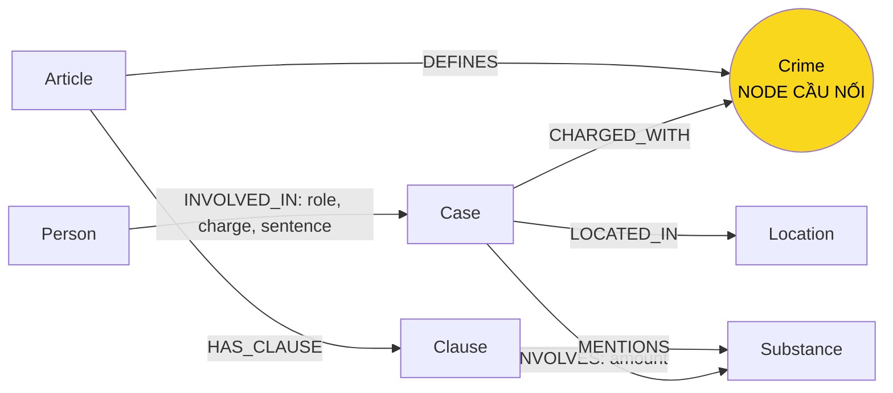

# Thiết kế Ontology — Day 19

**Họ tên:** Nguyễn Danh Gia Minh  **MSSV:** 2A202602441

**Lựa chọn** (đánh dấu một):
- [x] Dùng ontology gợi ý
- [ ] Tự thiết kế (xét bonus +15, xem `SUBMISSION.md`)

> Bản mô tả này phản ánh graph đã nạp và truy vấn được, không phải các mở
> rộng ontology mới dự định làm.

## 0. Khảo sát dữ liệu và benchmark

Đã đọc Điều 251 BLHS và các bài về Cái Quang Huy, Lê Minh Thành, Hoàng
Nato, vụ mua bán hơn 36 kg ma túy và Viện Pháp y tâm thần Trung ương.

- **KB luật:** có điều (`Article`), khoản (`Clause`), tên tội (`Crime`),
  chất ma túy (`Substance`), khung phạt và văn bản khoản. Mỗi khoản luật
  được nhận diện bằng regex; node `Clause` liên kết tới các chất được nhắc
  trong nội dung khoản.
- **KB tin:** có vụ việc (`Case`), người (`Person`), địa điểm (`Location`),
  tội/hành vi, chất/khối lượng, vai trò và mức án thực tế. Ví dụ tin ghi
  Dương Minh Tuấn tức “Hoàng Nato”; Lê Minh Thành bị tuyên 36 tháng; Cái
  Quang Huy bị cáo buộc vận chuyển hơn 9,6 kg MDMA và gần 406 g Ketamine.
- **Có ở cả hai KB:** `Crime` và `Substance`. Tội danh được nối theo tên
  chuẩn lấy từ tiêu đề Điều; chất được MERGE theo tên chuẩn. Tin có thể ghi
  “ma tuý”/“ma túy”, viết hoa khác nhau hoặc thêm chữ “tội”, nên cần
  `link_entity` cho tội danh. Node dùng chung `Crime`/`Substance` không có
  một `doc_id` duy nhất; node tài liệu `Article`, `Clause`, `Case`,
  `Person`, `Location` giữ `doc_id`.
- **Flat RAG:** Q1 và Q2 có thể trả lời từ đoạn luật/tin phù hợp. Q3–Q5 cần
  nối dữ kiện tin và điều luật; Q6 cần gom nhiều vụ theo chất. Vector RAG
  có thể tìm đoạn liên quan nhưng không tự biểu diễn quan hệ và ngưỡng.
  Benchmark hiện tại cho thấy Flat đạt Q1–Q2, nhưng không trả lời được
  Q3–Q4; Q5/Q6 chưa nêu đủ các ý bắt buộc.

## 1. Sơ đồ

Graph thực tế có 7 labels: `Article`, `Case`, `Clause`, `Crime`,
`Location`, `Person`, `Substance`; và 7 loại quan hệ:
`CHARGED_WITH`, `DEFINES`, `HAS_CLAUSE`, `INVOLVED_IN`, `INVOLVES`,
`LOCATED_IN`, `MENTIONS`.

## 2. Entity types (node labels)

| Label | Ý nghĩa | Khóa định danh (`MERGE` theo) | Properties thực tế | Lấy từ KB nào | Trích bằng |
| --- | --- | --- | --- | --- | --- |
| `Article` | Một Điều luật | `id` (ví dụ `Điều 251 BLHS`) | `id`, `title`, `law`, `doc_id` | Luật | Regex/metadata |
| `Clause` | Khoản trong một Điều | `id` (ví dụ `Điều 251 BLHS khoản 1`) | `id`, `number`, `penalty`, `text`, `doc_id` | Luật | Regex theo số khoản; regex câu hình phạt |
| `Crime` | Tội danh chuẩn nối tin và luật | `name` chuẩn hóa theo tên ở tiêu đề Điều | `name` | Cả hai | Regex tiêu đề luật; LLM trích tin rồi `link_entity` |
| `Case` | Vụ việc được trích từ bài báo | `name` do LLM tạo | `name`, `summary`, `date`, `doc_id`, `source_title` | Tin | LLM/JSON |
| `Person` | Người liên quan đến vụ | `name` đầy đủ do LLM trích | `name`, `aliases`, `doc_id` | Tin | LLM/JSON |
| `Location` | Địa điểm liên quan | `name` do LLM tạo | `name`, `doc_id` | Tin | LLM/JSON |
| `Substance` | Chất ma túy được nhắc | `name` trong danh sách tên chuẩn | `name` | Cả hai | Luật: danh sách/regex; tin: LLM/JSON |

Mức án luật được lưu trong `Clause.penalty`; mức án thực tế lưu trên cạnh
`INVOLVED_IN.sentence`. Khối lượng trong tin nằm ở
`INVOLVES.amount`. Các ngưỡng định lượng của luật hiện chỉ còn trong
`Clause.text`; graph chưa tách chúng thành thuộc tính số có thể so sánh.
Điều 2 khoản 4 Luật PCMT có định nghĩa tiền chất trong nguồn luật nhưng
ontology/code hiện tại không tạo node `Definition`.

## 3. Relationships

| Type | Từ → Đến | Properties thực tế trên cạnh | Ý nghĩa |
| --- | --- | --- | --- |
| `DEFINES` | `Article` → `Crime` | Không có | Điều luật định nghĩa tên tội chuẩn |
| `HAS_CLAUSE` | `Article` → `Clause` | Không có | Điều luật có các khoản |
| `MENTIONS` | `Clause` → `Substance` | Không có | Khoản luật nhắc tên chất, không phải biểu diễn ngưỡng có cấu trúc |
| `CHARGED_WITH` | `Case` → `Crime` | Không có | Tội danh được trích cho vụ |
| `INVOLVES` | `Case` → `Substance` | `amount` | Chất và khối lượng trích từ tin |
| `LOCATED_IN` | `Case` → `Location` | Không có | Địa điểm vụ do LLM trích |
| `INVOLVED_IN` | `Person` → `Case` | `role`, `charge`, `sentence` | Vai trò, cáo buộc và mức án người trong vụ |

## 4. Node cầu nối giữa 2 KB

- **Node nào:** `Crime`.
- **Vì sao chọn node này:** luật nối `Article` với tên tội qua `DEFINES`;
  tin nối `Case` với cùng tên tội qua `CHARGED_WITH`. Đường đi Q3/Q4/Q5 là
  từ người/vụ qua tội đến Điều và khoản.
- **Cách đảm bảo hai phía khớp tên:** lấy tên chuẩn từ Điều luật; dùng
  `normalize_crime` và `link_entity` để chuẩn hóa chữ hoa/thường, tiền tố
  “Tội” và biến thể “tuý/túy”. Hàm trả nguyên văn tên chuẩn trong `known`;
  tên không đủ gần không được nối.
- **Khi nào cầu gãy, và xử lý:** bài có thể chỉ mô tả hành vi hoặc dùng
  tội danh không có trong tập Điều luật. Khi đó `link_entity` trả `None`,
  cạnh không được tạo. Đây là lựa chọn an toàn hơn nối nhầm; cần bổ sung
  đúng Điều luật/alias hoặc kiểm tra lại extraction trước khi nối.

## 5. Competency questions

| Câu | Đường đi (Cypher pattern) | Trả lời được? |
| --- | --- | --- |
| Q1 | Không có đường graph tới nội dung định nghĩa vì ontology không tạo node `Definition`. Đoạn luật vẫn có thể được tìm từ vector chunk. | **Không bằng graph**; Flat RAG trả lời được từ Điều 2 khoản 4. |
| Q2 | `(:Person)-[r:INVOLVED_IN]->(:Case)`; lọc `r.sentence` là tử hình, lấy tên hai người từ vụ đường dây hơn 36 kg. | Có, nếu LLM tách đúng bị cáo và mức án cho từng người. |
| Q3 | `(:Person {name:'Lê Minh Thành'})-[:INVOLVED_IN]->(:Case)-[:CHARGED_WITH]->(:Crime)<-[:DEFINES]-(:Article {id:'Điều 251 BLHS'})-[:HAS_CLAUSE]->(:Clause {number:1})`; mức án thực tế trên `INVOLVED_IN.sentence`, khung cơ bản trên `Clause.penalty`. | Có về mặt graph; benchmark hiện trả nhầm 24 thay cho 36 tháng, lỗi gắn người/mức án hoặc generation. |
| Q4 | `(:Person {name:'Dương Minh Tuấn'})-[:INVOLVED_IN]->(:Case)-[:CHARGED_WITH]->(:Crime)<-[:DEFINES]-(:Article {id:'Điều 255 BLHS'})-[:HAS_CLAUSE]->(:Clause)`; đọc các khoản và chọn khung cao nhất. | Có về mặt graph; `context()` hiện chỉ đưa khoản 1 nếu không được hỏi Điều trực tiếp, nên benchmark đã trả thiếu mức tối đa. |
| Q5 | `(:Person {name:'Cái Quang Huy'})-[:INVOLVED_IN]->(:Case)-[r:INVOLVES]->(:Substance {name:'MDMA'})`; từ vụ qua `CHARGED_WITH` tới `Article` Điều 250 và `Clause` 4; ngưỡng được đọc từ `Clause.text`. | Có một phần; text có ngưỡng nhưng chưa cấu trúc hóa số lượng/đơn vị. Cần kiểm tra LLM không lấy nhầm ngưỡng của nhóm chất khác. |
| Q6 | `(:Case)-[r:INVOLVES]->(:Substance {name:'MDMA'})`; lấy `Case.name`, `summary`, `doc_id`, người liên quan. | Có trong corpus đã nạp; kết quả phụ thuộc các chất/vụ LLM trích được. |

## 6. Quyết định thiết kế và đánh đổi

1. **Dùng `Crime` làm cầu nối:** thay vì nối mọi vụ với mọi Điều về ma túy,
   chỉ nối khi tên tội ánh xạ được về tên chuẩn. Giảm nối sai nhưng có thể
   bỏ sót vụ không nêu rõ tội danh.
2. **Lưu khung phạt ở `Clause` và án thực tế trên `INVOLVED_IN`:** phân
   biệt luật quy định với mức án của cá nhân. Cần LLM trích và gắn đúng
   mức án cho từng người; Q3 cho thấy sai gắn kết vẫn có thể xảy ra.
3. **Dùng `name` làm khóa của `Case`/`Person` và danh sách chuẩn cho
   `Substance`:** dễ MERGE và truy vấn, nhưng tên vụ do LLM đặt có thể
   khác giữa bài, bí danh/người trùng tên có thể sinh trùng hoặc nhập sai.
4. **Giữ văn bản khoản thay vì parse ngưỡng thành số:** đơn giản, lưu đủ
   nội dung pháp lý nhưng việc so sánh lượng trong Q5 phụ thuộc LLM đọc
   đúng từng điểm; benchmark đã minh họa nguy cơ nhầm ngưỡng.

## 7. So với ontology gợi ý

Không xét bonus tự thiết kế; graph dùng ontology gợi ý với các label và
quan hệ đúng như sơ đồ ở mục 1. Các ý tưởng tạo node `Definition`, cấu
trúc hóa ngưỡng khối lượng và khóa vụ ổn định đã được cân nhắc nhưng chưa
triển khai; không mô tả chúng như tính năng có trong graph.

| Điểm khác | Gợi ý làm gì | Bạn làm gì | Vấn đề nó giải quyết | Bằng chứng |
| --- | --- | --- | --- | --- |
| Không có khác biệt ontology đã triển khai | Labels/relations gợi ý | Giữ labels/relations gợi ý, không xét bonus | Báo cáo phản ánh graph thật, không tuyên bố phần mở rộng chưa code | Neo4j đã kiểm tra có 7 labels: `Article`, `Case`, `Clause`, `Crime`, `Location`, `Person`, `Substance`; 7 quan hệ như bảng mục 3 |

## 8. Hạn chế còn lại

- Q1 không có node định nghĩa; GraphRAG chỉ có thể lấy đáp án qua vector
  chunk của luật.
- LLM có thể gán nhầm án thực tế cho người khác (Q3: 24 tháng thay vì 36).
- `context()` chưa lấy khoản cao nhất từ luật tìm được qua cầu `Crime` khi
  câu hỏi không nêu trực tiếp số Điều (Q4).
- Ngưỡng định lượng trong `Clause.text` chưa được parse thành số/đơn vị
  (Q5); cần tránh nhầm các điểm luật khác nhau.
- Khóa `Case`/`Person` theo tên không giải quyết triệt để bí danh, người
  trùng tên và việc nhiều bài nói về cùng một vụ.
- Tin phản ánh giai đoạn tố tụng tại lúc đăng; cáo buộc/điều tra không
  đồng nghĩa bản án kết tội cuối cùng.
- Q6 chỉ tổng hợp corpus hiện có; extraction chất bị bỏ sót sẽ làm thiếu
  kết quả.
